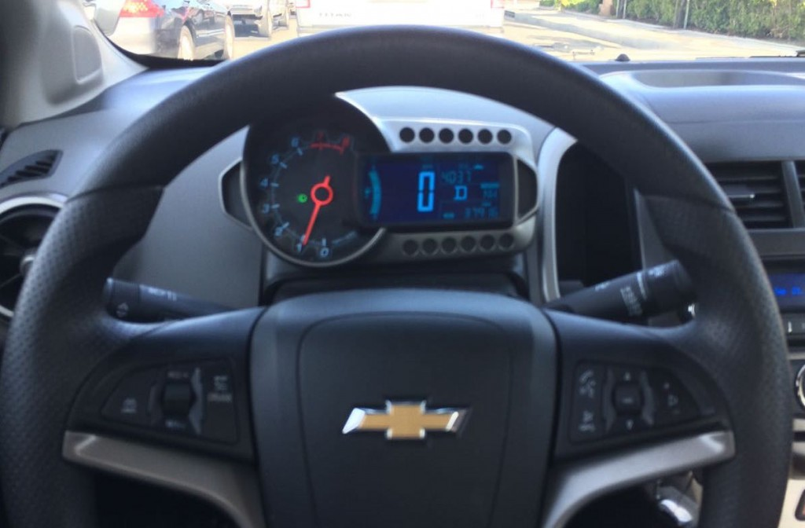
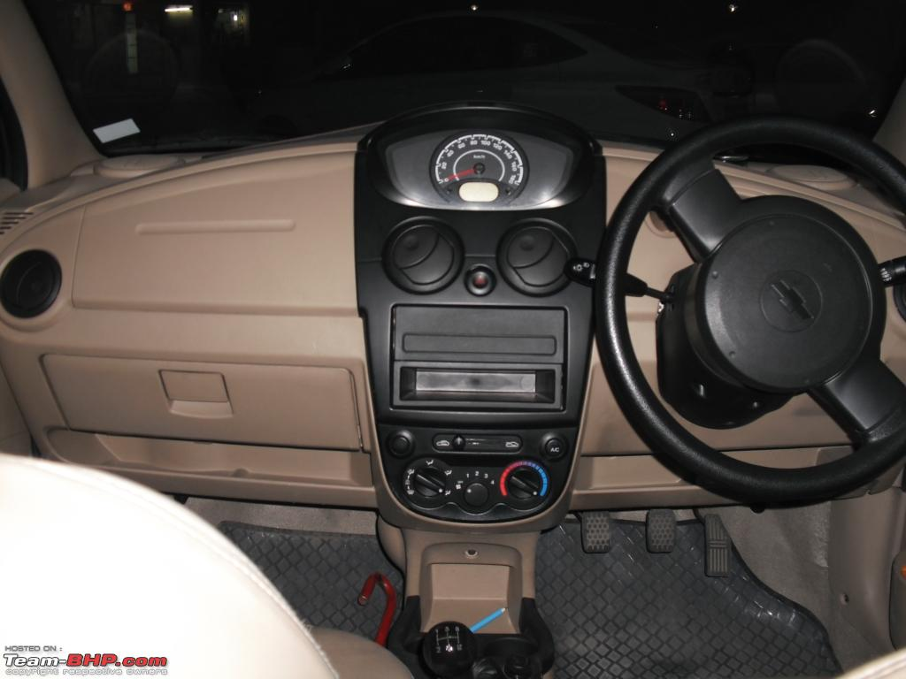
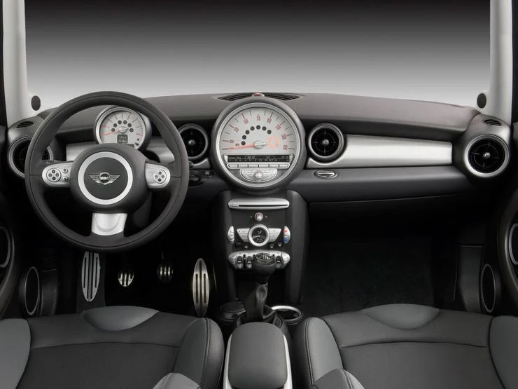
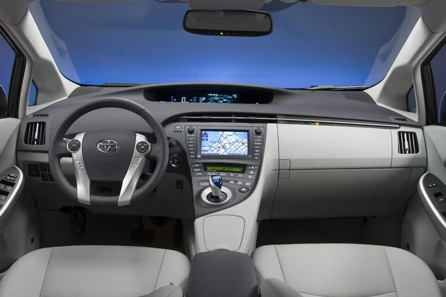

<h1>HCI CS5331 Spring 21</h1>

<h1>Aniruddh Sanjaysinh Chavda</h1>

<h2>Presentation URL</h2>
https://aniruddhchavda.github.io/p2AniruddhChavda

<h1>PART C</h1>

<h2>Five Examples of Car Dashboards</h2>
<h3>Chevrolet Sonic</h3>

<h3>Chevrolet Spark</h3>

<h3>Fiat Multipla</h3>

<h3>MINI Cooper</h3>

<h3>Toyota Prius</h3>

<h2>Pros vs Cons with the current design</h2>
<ul>
  <h3>Pros</h3>
  <li>Most of the cars display speed and range.</li>
  <h3>Cons</h3>
  <li>Some cars have instrument cluster on the middle, which is distacting.</li>
  <li>Tachometer is bigger than speedometer</li>
  <li>Tachometer and speedometer are far away</li>
</ul>

