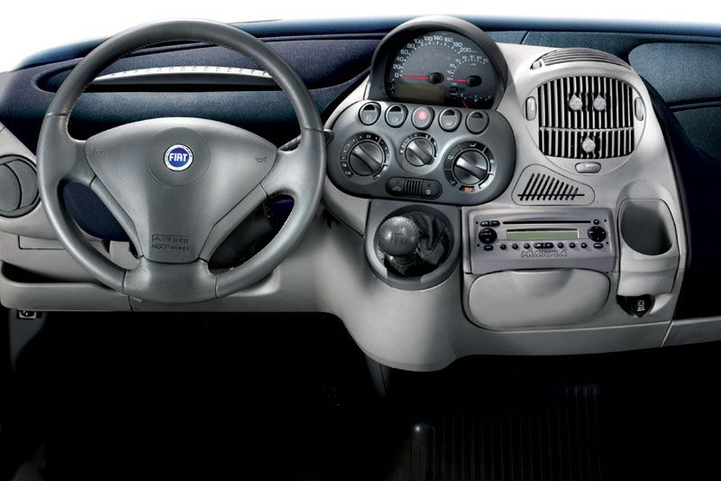
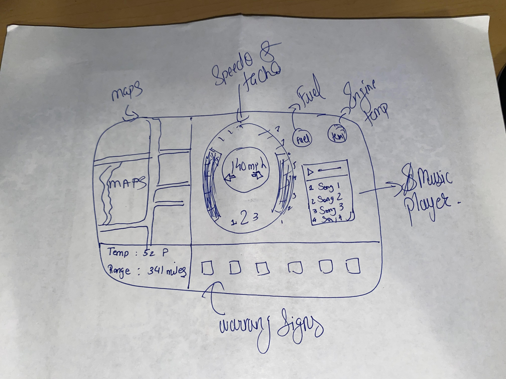

https://aniruddhchavda.github.io/TeslaDashboardInterface/

<h1>PART C</h1>

<h2>Five Examples of Car Dashboards</h2>
<h3>Chevrolet Sonic</h3>

<h3>Chevrolet Spark</h3>

<h3>Fiat Multipla</h3>

<h3>MINI Cooper</h3>

<h3>Toyota Prius</h3>

<h2>Pros vs Cons with the current design</h2>
<ul>
  <h3>Pros</h3>
  <li>Most of the cars display speed and range.</li>
  <h3>Cons</h3>
  <li>Some cars have instrument cluster on the middle, which is distacting.</li>
  <li>Tachometer is bigger than speedometer</li>
  <li>Tachometer and speedometer are far away</li>
</ul>

<h1>Part B</h1>
<h3>Most Common Features/Uses</h3>
<ul>
  <li>Main Use : Keep an eye on the speed !</li>
  <li>Check the range(Fuel Left)</li>
  <li>Check the mileage</li>
</ul>

<h3>Rare Uses</h3>
<ul>
  <li>Check tire pressure</li>
  <li>Check RPM(Tachometer)</li>
  <li>Check Engine Temp</li>
</ul>

<h3>Common mistakes one can do with the current design</h3>
<ul>
  <li>One can easily run out of fuel if proper range is not displayed.</li>
  <li>Get distracted while trying to find the right information.</li>
<ul>
  
  <h3>Sketch of my design</h3>

<h2>Part A</h2>

<h3>Working GIF Image</h3>

<h3>Benefits of this design</h3>
<ul>
  <li>Completely Digital Design</li>
  <li>Big Speeedo and tachometer</li>
  <li>Smaller Fuel and Engine heat gauge</li>
  <li>Music Player</li>
</ul>
